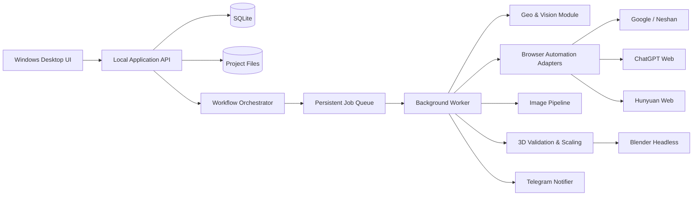

# Technical Architecture

## 1. سبک معماری

MVP به‌صورت **Local-first Modular Monolith** ساخته می‌شود. یک installer ویندوزی شامل Desktop UI، هسته دامنه، orchestrator، workerهای پس‌زمینه و local API است. اجزا در processهای جدا قابل‌اجرا هستند، اما deployment توزیع‌شده ندارند.

این انتخاب پیچیدگی عملیاتی را پایین نگه می‌دارد، درحالی‌که مرزبندی ماژول‌ها مهاجرت آینده به سرویس‌های جدا را ممکن می‌کند.

## 2. اجزای اصلی

## 3. ماژول‌های دامنه

### Project Management

ایجاد پروژه، تنظیم مسیرها، preflight، lifecycle، summary و export report.

### Building Inventory

footprint، کدگذاری، مختصات، ابعاد، جهت‌ها، ارتفاع، طبقات و تغییرات انسانی.

### Workflow Orchestration

state machine، dependency مراحل، checkpoint، retry، pause/resume و recovery.

### Reference Acquisition

provider interface برای Google و نشان، ذخیره source metadata، scoring و fallback به استخر دستی.

### Height Estimation

استراتژی‌های مستقل: sun metadata، calibration با ساختمان مرجع، شمارش طبقات و override انسانی. نتیجه شامل value، range، method و confidence است.

### View Generation

prompt assembly، کنترل ChatGPT، ذخیره شیت، crop، validation و revision history.

### Model Generation

کنترل Hunyuan، upload mapping، polling، download، validation، scaling و final export.

### Notification

ارسال اعلان best-effort، deduplication و ثبت delivery status.

## 4. مرز لایه‌ها

- **Presentation:** PySide views و view-modelها؛ بدون منطق کسب‌وکار.
- **Application:** use caseها، command/query، transaction و orchestration.
- **Domain:** entity، value object، policy و state transition؛ بدون وابستگی به UI یا provider.
- **Infrastructure:** SQLite، filesystem، Playwright، OpenCV، Blender و Telegram.

وابستگی‌ها باید از بیرون به داخل باشند. Domain نباید Playwright، SQLAlchemy یا PySide را import کند.

## 5. State Machine و اجرای پایدار

هر ساختمان state مستقل دارد. Orchestrator فقط jobهایی را enqueue می‌کند که prerequisite آن‌ها تکمیل شده است. پیش از عملیات خارجی، attempt با وضعیت `Started` ثبت می‌شود؛ پس از موفقیت artifactها atomically ثبت و attempt `Succeeded` می‌شود.

در startup، recovery service موارد `Running` قدیمی را بررسی می‌کند:

- اگر artifact معتبر وجود دارد، stage finalize می‌شود.
- اگر عملیات خارجی نامشخص است، reconciliation انجام می‌شود.
- اگر قابل تشخیص نیست، attempt به `Interrupted` و job به retry منتقل می‌شود.

## 6. Browser Automation

- یک Chromium profile اختصاصی و persistent برای محصول استفاده می‌شود.
- هر provider adapter مالک URL detection، selectorها، upload/download و health check خود است.
- selectorها در فایل versioned نگهداری می‌شوند.
- screenshot و HTML snapshot هنگام شکست ذخیره می‌شود؛ داده حساس باید redact شود.
- browser automation در worker جدا اجرا می‌شود تا crash مرورگر UI را از کار نیندازد.
- عملیات providerها در MVP به‌صورت serial انجام می‌شود تا session و rate limit مدیریت شود.

کنترل رابط وب یک integration شکننده است و باید قابلیت غیرفعال‌کردن provider و اجرای دستی stage وجود داشته باشد.

## 7. ذخیره‌سازی

### SQLite

منبع حقیقت برای پروژه‌ها، ساختمان‌ها، stageها، attempts، approvals، artifacts و notifications.

### Filesystem

فایل‌های حجیم، تصاویر، snapshots، FBX و report. دیتابیس فقط path نسبی، hash، MIME type، size و lineage را نگه می‌دارد.

### Atomicity

فایل ابتدا با پسوند `.partial` نوشته، hash و validate، سپس rename می‌شود. ثبت artifact نهایی و transition وضعیت در یک transaction انجام می‌گیرد.

## 8. موجودیت‌های اصلی داده

- `Project`
- `Building`
- `FootprintRevision`
- `HeightEstimate`
- `ReferenceImage`
- `GeneratedViewSet`
- `ModelArtifact`
- `WorkflowStage`
- `JobAttempt`
- `Approval`
- `Notification`
- `AuditEvent`

## 9. امنیت

- Telegram token در Windows Credential Manager نگهداری می‌شود.
- credential حساب‌های وب توسط browser profile مدیریت می‌شود؛ برنامه password ذخیره نمی‌کند.
- profile مرورگر خارج از پوشه قابل‌تحویل پروژه است.
- logها و screenshotهای خطا قبل از export برای token، cookie و اطلاعات session بررسی/redact می‌شوند.
- local API فقط روی `127.0.0.1` bind می‌شود و یک session token محلی دارد.

## 10. Observability

- JSON logs با `project_id`, `building_id`, `stage`, `attempt_id` و `correlation_id`
- dashboard وضعیت و مدت هر مرحله
- artifact lineage از منبع تا FBX
- health status برای browser، providerها، disk، database، Blender و Telegram
- report نهایی HTML برای استفاده انسانی

## 11. Deployment

- installer امضاشده ویندوزی
- database و app state در `%PROGRAMDATA%/NearProjectEnvironment`
- تنظیمات کاربر در `%APPDATA%/NearProjectEnvironment`
- پروژه‌ها در مسیر انتخابی کاربر
- Blender runtime به‌صورت prerequisite ثابت یا bundle مجاز
- migration خودکار دیتابیس با backup قبل از upgrade

