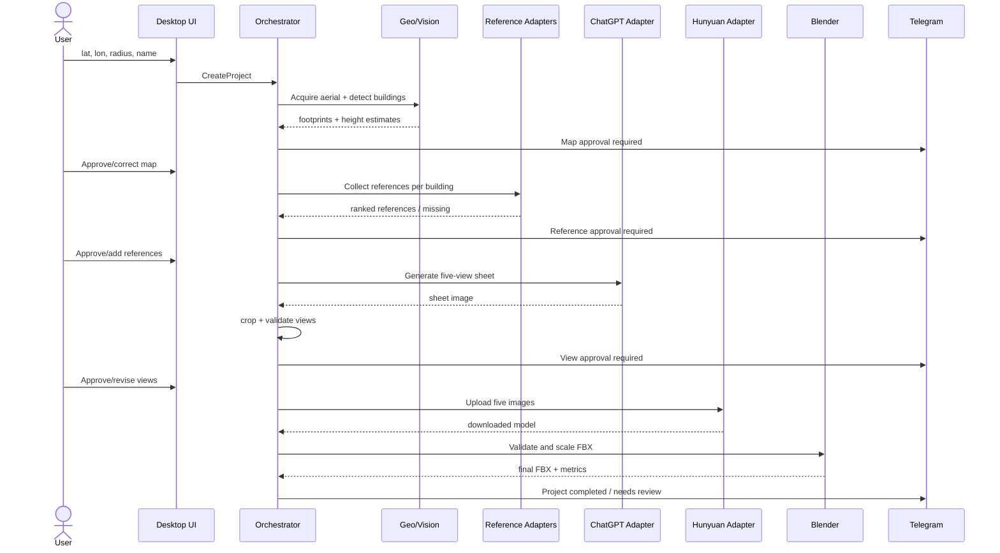
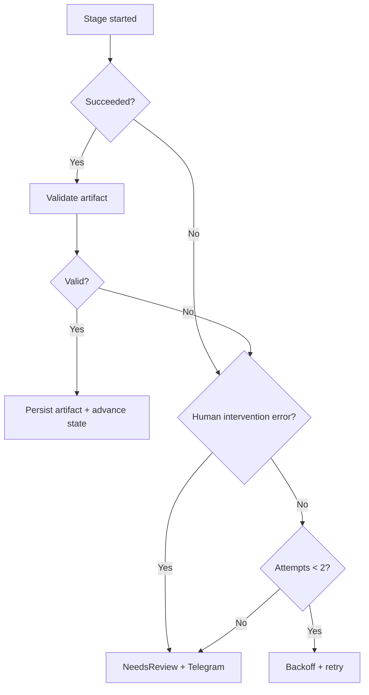

# Data Flow

## 1. جریان سطح بالا

## 2. جریان داده ساختمان

### A. Detection

`Project coordinates → projected metric bounding area → aerial image → candidate footprints → circle intersection filter → building codes → annotated overview`

قاعده مرزی پیشنهادی: ساختمانی داخل scope است اگر footprint آن با دایره شعاع پروژه تقاطع داشته باشد. UI باید امکان حذف دستی موارد مرزی را بدهد.

### B. Height

`Aerial/reference evidence → estimator strategies → candidate estimates → confidence/range → human approval → approved height`

هر estimate immutable است. اصلاح کاربر estimate جدید با `source=human_override` می‌سازد.

### C. Reference

`Provider observation → raw image + camera metadata → building projection match → quality/occlusion score → candidate ranking → approval snapshot`

اگر candidate واقعی کافی نبود:

`manual project pool → image analysis → similarity score → candidate ranking → user choice`

اگر pool خالی یا نامناسب بود، ساختمان متوقف و `MissingReference` می‌شود.

### D. Generated Views

`approved references + approved dimensions + prompt template version → ChatGPT sheet → original artifact → template crop → five view artifacts → approval`

قرارداد اجباری تولید تصویر پیش از Approval بررسی می‌شود: تکسچر و رنگ واقعی نما، ممنوعیت خروجی سفید/طوسی/clay، پس‌زمینه خاکستری تیره یکنواخت، اشغال ۶۵ تا ۸۵ درصد پنل و ثبات هندسه میان پنج جهت.

Prompt، template version و reference hash باید برای reproducibility ثبت شوند.

### E. Model

`approved five views → Hunyuan job → raw download → quarantine → Blender import → geometry checks → scale to approved height → FBX export → checksum → completed artifact`

فایل خام Hunyuan حفظ می‌شود تا در صورت اشکال scaling قابل بررسی باشد.

## 3. Data Lineage

هر artifact این فیلدها را دارد:

- `artifact_id`
- `project_id`
- `building_id` در صورت ارتباط
- `artifact_type`
- `relative_path`
- `sha256`
- `size_bytes`
- `created_at`
- `producer_stage`
- `attempt_id`
- `parent_artifact_ids`
- `tool/provider_version`

این lineage امکان پاسخ به این سؤال را می‌دهد: «این FBX با کدام تصاویر، کدام ارتفاع و کدام اجرای ChatGPT/Hunyuan ساخته شده است؟»

## 4. Approval Snapshot

تأیید نباید صرفاً یک boolean روی داده mutable باشد. هنگام تأیید، snapshot شامل شناسه و hash داده‌های تأییدشده ثبت می‌شود. اگر footprint، ارتفاع یا مرجع بعداً تغییر کند، تأییدهای downstream باطل می‌شوند.

مثال:

- تغییر ارتفاع: تأیید نما ممکن است باقی بماند، ولی model scaling باید دوباره اجرا شود.
- تغییر reference: تأیید view و model باطل می‌شود.
- تغییر footprint عمده: reference assignment، views و model نیاز به بازبینی دارند.

## 5. Failure Flow

## 6. Notification Flow

Domain event ابتدا در database ثبت می‌شود. notification dispatcher آن را می‌خواند، پیام را ارسال و delivery status را ثبت می‌کند. شکست Telegram روی workflow اصلی اثر ندارد و خود اعلان با backoff جدا retry می‌شود.

## 7. حریم و نگهداری داده

- تصاویر و مدل‌ها تا زمان حذف پروژه نگهداری می‌شوند.
- browser cookies و tokenها وارد project folder نمی‌شوند.
- debug traceهای browser retention کوتاه و قابل‌تنظیم دارند.
- حذف پروژه باید دو مرحله‌ای باشد و در MVP به Recycle Bin یا archive منتقل شود، نه حذف قطعی فوری.
